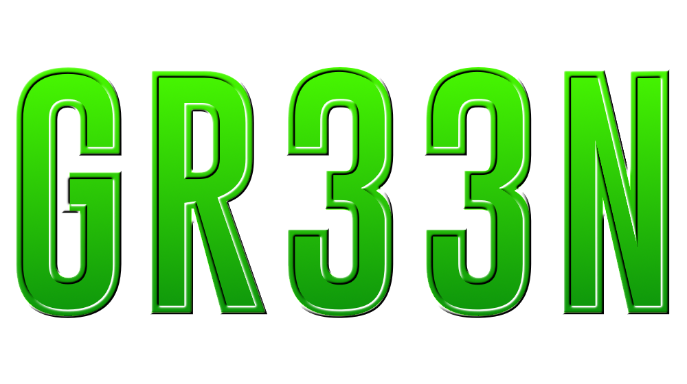
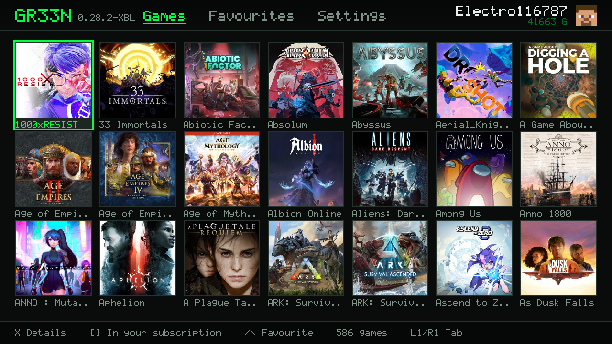

<h1 align="center">GR33N</h1>

  
  
  

A standalone, open-source Xbox Cloud Gaming (xCloud) client for the PlayStation 3 (homebrew). 

> [!TIP]
> Current limitations are tracked as [issues](https://github.com/actuallyniaxx/GR33N/issues).
> Worth a look before your first session.

## Install

You need a homebrew-enabled PlayStation 3 and an Xbox account with a subscription that allows you to access Xbox Cloud Gaming.

1. Download `gr33n.pkg` from the
   [latest release](https://github.com/actuallyniaxx/GR33N/releases/latest).
2. Transfer the PKG to the PlayStation 3 System with your preffered method or put it on an FAT32 formatted flash drive.
3. Install it from the XMB.
4. Launch GR33N and follow the device-code sign-in procedure that will appear on the screen.

> [!IMPORTANT]
> This procedure will only appear automatically if you don't have a session token on your system.
> If you already had a token and it expired or was manually revoked you can re-login again from the settings tab.

> [!NOTE]
> GR33N shows up in the Network column of the XMB, not among the games — it's a network application

## Controls

The DualShock 3 maps to an Xbox pad the obvious way.  and  can be swapped
in Settings, and the dead zone is rescaled rather than clipped, so the stick
doesn't jump the moment it leaves it.

> [!NOTE]
> The option to swap  and  will only take effect on the app's interface,
> it won't do anything on the games as the controls are directly mapped.

| PS3 | Xbox |
|---|---|
|  /   | A / B |
|  /  | X / Y |
|  /  | L / R |
|  /  | LB / RB |
|  /  | LT / RT |
|  /  | LS / RS |
| SELECT / START | View / Menu |

To leave a game: **SELECT + Back** by default, configurable to SELECT +
START, L1+R1+START or L3+R3.

## Building from source

1. Environment

You need [PSL1GHT](https://github.com/ps3dev/psl1ght). On Windows it works fine under WSL2.

`sh
export PS3DEV=/usr/local/ps3dev
export PSL1GHT=$PS3DEV
export PATH=$PATH:$PS3DEV/bin:$PS3DEV/ppu/bin:$PS3DEV/spu/bin`

2. Dependencies

GR33N depends on native libraries, none of them packaged for the PS3. The scripts fetch, patch and build them into ~/.gr33n-deps/.

Order matters — each one needs the previous one's headers:

`sh
sh deps/build-mbedtls.sh     # TLS and DTLS
sh deps/build-libsrtp.sh     # SRTP
sh deps/build-usrsctp.sh     # SCTP, for the data channels
sh deps/build-libpeer.sh     # WebRTC (applies deps/libpeer-ps3.patch)
sh deps/build-opus.sh        # Opus, fixed-point`

Each script checks what it built and reports if something doesn't go as expected.

3. Build
   
`sh
make          # gr33n.self + gr33n.fake.self
make pkg      # installable gr33n.pkg
make run      # ps3load over the network`

4. Tests

`sh
sh t/correr.sh          # all 22
sh t/correr.sh audio    # just one`

They run on a PC, with an ordinary gcc, under ASan and UBSan. They test the arithmetic: RTP reordering, the PCM ring, pad mapping, NAL slicing, message parsing. None of that needs a PS3.

Passing does not mean GR33N works — the decoder, the RSX and lv2's network stack are only testable on real hardware. If something breaks, it isn't this.

They exist for a reason. The PCM ring in aud.c was sized at 8192 pairs, which with an Opus frame of up to 5760 left about 50 ms usable for a 160 ms cushion. The audio would never have started, and nothing was broken: every piece did its job and the result was silence. That doesn't show up on a read. This test caught it on the first run, before anything was compiled for the console.

## Repository layout
`source/      the program
include/     its headers
shaders/     the two RSX shaders
data/        clip.h264, the test video that gets built into the binary
pkgfiles/    ICON0.PNG and friends, the XMB entry
t/           the PC tests
deps/        what you need to compile: the build-*.sh scripts, the libpeer
             patch, cJSON, the POSIX shim for PSL1GHT`

The source comments are in Spanish. They're also, in places, the only documentation of why the PS3 behaves the way it does — the endianness traps in the H.264 depacketiser, usrsctp's length-prefixed sockaddr_conn, and why there is no select() anywhere in the tree. Worth a translation pass if you're porting this elsewhere.

## Credits

GR33N wouldn't exist without two projects that came first:

[green-nx](https://github.com/rmrf404/green-nx), by rmrf404 — the xCloud client for the Nintendo Switch. Its libpeer patch is what encodes how you actually talk to xCloud, and adapting it was far more honest than rewriting it. It's GPL-3, which is why GR33N is too.

[green-vita](https://github.com/Day-OS/green-vita), by Day-OS — the PS Vita one, which is where the idea that this would fit on an old Sony console came from.

Full third-party licences ([libpeer](https://github.com/sepfy/libpeer), [usrsctp](https://github.com/sctplab/usrsctp), [libSRTP](https://github.com/cisco/libsrtp), [mbedTLS](https://github.com/Mbed-TLS/mbedtls), [Opus](https://github.com/xiph/opus), [cJSON](https://github.com/Davegamble/cjson), [PSL1GHT](https://github.com/ps3dev/psl1ght)) are in [CREDITOS](CREDITOS).

GR33N is an independent homebrew project and is not affiliated with or endorsed by Microsoft, Xbox, Sony, or PlayStation.

## License

GR33N is licensed under the [GNU General Public License version 3](LICENSE).
